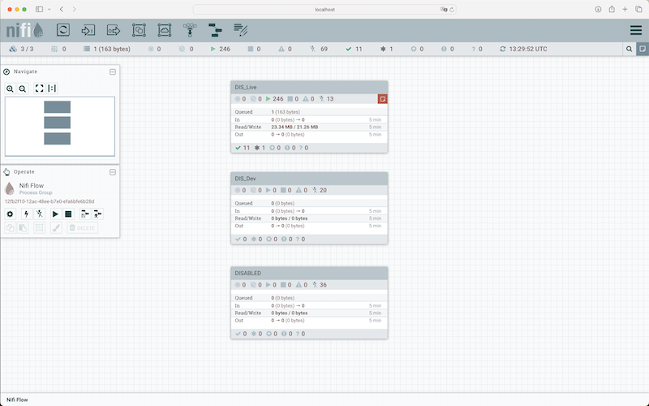

## SOP Monitor Data Flows Rooster Synchronisatie

### Bulletin Board
* Initially, establish a connection to AKS and Apache NiFi by following the "CONNECT-TO-AKS" SOP.
* Access Apache NiFi's interface by navigating to http://localhost:8080/nifi in your web browser. 
 
   
 
* The NiFi User Interface provides a significant amount of monitoring and feedback about the current status of the application. In addition to rolling statistics and the current status provided for each component, components are able to report Bulletins. Whenever a component reports a Bulletin, a bulletin icon is displayed on that component. System-level bulletins are displayed on the Status bar near the top of the page. Using the mouse to hover over that icon will provide a tool-tip that shows the time and severity (Debug, Info, Warning, Error) of the Bulletin, as well as the message of the Bulletin. Bulletins from all components can also be viewed and filtered in the Bulletin Board Page, available in the Global Menu.

 

### Status Bar
* The Status bar provides information about the overall health of the system. You can find it at the top of the NiFi UI, under the component toolbar. It contains important statistics about the current health of NiFi. The number of active threads can indicate how hard NiFi is working, and the queued statistics indicate how many FlowFiles are queued across the entire flow, and the total size of those FlowFiles.

* If the NiFi instance is in a cluster, we will also see an indicator here telling us how many nodes are in the cluster and how many are currently connected. In this case, the number of active threads and the queue size are indicative of the sum of all nodes that are currently connected.

 

### Component Statistics
* Each processor, process group, and remote process group on the canvas provides fine-grained statistics about their operations. Connections and process groups provide information about the amount of data in their queues. Processors provide information on how much data they processed in the last five minutes. This is a rolling window and allows you to see things like the number of FlowFiles that have been consumed by a processor, as well as the number of FlowFiles that have been emitted by the processor. The connections between processors also expose the number of items that are currently queued.

 

### Queue Interaction
* You can view the FlowFiles queued in a connection when necessary. Right-click a connection, and click List queue in the context menu to open the queue listing. You can check the list even when the source and destination processors are actively running.  
Additionally, details for a Flowfile in the listing can be viewed by clicking Details in the left-most column. From here, the FlowFile details and attributes are available along with the buttons for downloading or viewing the content. If the source or destination of the connection is actively running, there is a chance that the desired FlowFile is no longer in the active queue.  
You can delete FlowFiles queued in a connection. Right-click the connection, and click Empty queue in the context menu to initiate the removal of the FlowFiles. You can remove FlowFiles even if the source and destination processors are actively running.

 

### NiFi Summary Page
*  NiFi Summary provides information about all of the components on the canvas in a tabular format. It also provides system diagnostics that include disk usage, CPU utilization, Java heap, and garbage collection information. To access the summary page, click Summary in the Global Menu at the top-right corner of the NiFi UI. Clicking this option takes you to the summary page, where you can get information about all the components of that particular NiFi instance or cluster. You can monitor the following components in the NiFi summary UI:  
Processors Input ports Output ports Remote process groups Connections Process groups Depending on the component, you can filter by name, type, or UIR.

 

### Data provenance

Because all of the FlowFile attributes and the pointer to the content are kept in the Provenance Repository, a Dataflow Manager is able to not only see the lineage, or processing history, of that piece of data, but is also able to later view the data itself and even replay the data from any point in the flow. A common use-case for this is when a particular down-stream system claims to have not received the data. The data lineage can show exactly when the data was delivered to the downstream system, what the data looked like, the filename, and the URL that the data was sent to – or can confirm that the data was indeed never sent. In either case, the Send event can be replayed with the click of a button (or by accessing the appropriate HTTP API endpoint) in order to resend the data only to that particular downstream system. Alternatively, if the data was not handled properly (perhaps some data manipulation should have occurred first), the flow can be fixed and then the data can be replayed into the new flow, in order to process the data properly.

 

### Logging

In addition to the accessible monitoring features available in the GUI, there is extensive logging.

For instance, display all `InvokeMicrosoftGraphCalendar` log events.

```
kubectl logs nifi-1 app-log | grep -e "InvokeMicrosoftGraphCalendar"
```
 
 


