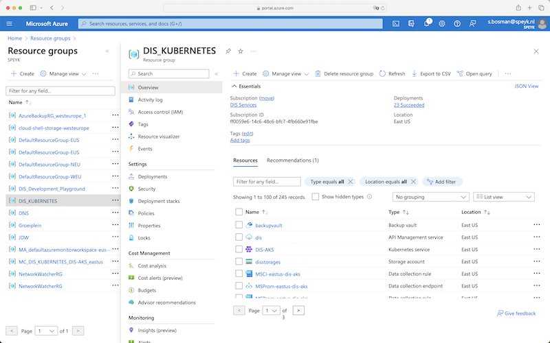
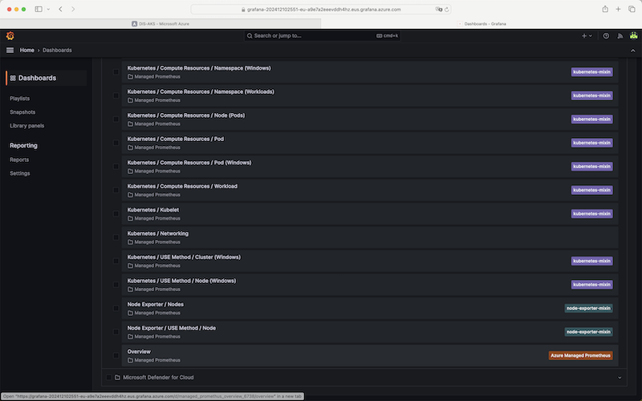
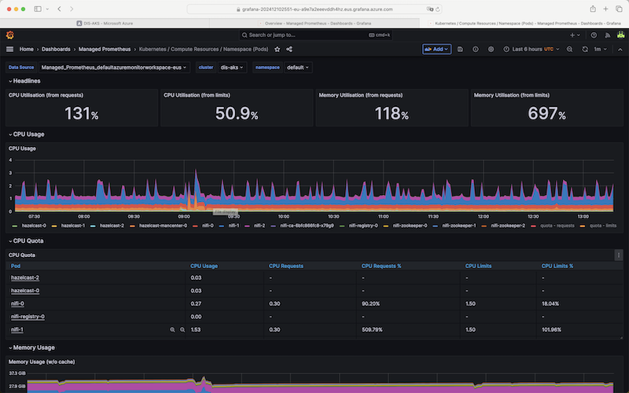

## Accessing Resource Group DIS_KUBERNETES in Azure

1. **Open the Azure Portal**:
   - Launch your web browser and navigate to the Azure portal at [https://portal.azure.com](https://portal.azure.com).

2. **Sign in to Azure**:
   - Enter your Azure credentials to log in.

3. **Locate the Resource Group**:
   - Once logged in, go to the `Resource Groups` and find `DIS_KUBERNETES`.

   

4. **Access Kubernetes Service**:
   - Within the `DIS_KUBERNETES` Resource Group, locate and click on the `DIS-AKS` Kubernetes service to view its details.

## Using Azure Managed Grafana

1. **Explore Grafana Dashboard**:
   - In Grafana, navigate to the monitoring section and click `Explore` in `grafana-202412102551-eu`.

2. **View Overview Dashboard**:
   - Go to `Home -> Dashboards -> Overview`.

   

3. **Inspect Specific Kubernetes Namespace Resources**:
   - Select `Kubernetes / Compute Resources / Namespace(Pods)` and then `namespace default` to view its metrics.

   

4. **Explore Additional Reports**:
   - Navigate through other reports available on the dashboard as necessary for your analysis.

## Setting Up Alerting in Grafana

1. **Configure Alerts**:
   - To set up alerting, head over to `Home -> Alerting`.
   - Customize the alerting rules to suit your requirements.
` 