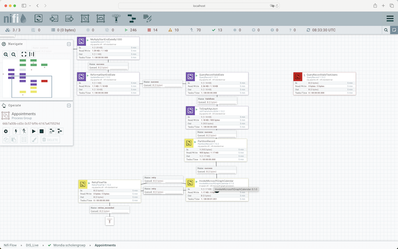

## SOP rooster synchronisation Zermelo

### Cloning an Existing Processor Group

* Initially, establish a connection to AKS and Apache NiFi by following the "CONNECT-TO-AKS" SOP.
* Access Apache NiFi's interface by navigating to http://localhost:8080/nifi in your web browser. 
 
   

* Locate and select the "DIS_Live" Process Group. From there, choose a specific Process Group, such as "Mondia scholengroep," and duplicate it.

 

### Setting Up a Parameter Context

* After duplicating the Process Group, right-click on it and select "configure" to begin setting it up.
 
 

* Assign a name to your Process Group and create a new parameter context for it.

 

* Define the parameter context by giving it a name and entering the following parameters:

 | Name | Value |
| :---- | :----- |
| zermelo.appointments.full | /api/v3/appointments/?startWeekOffset=0&endWeekOffset=3&fields=id,valid,appointmentInstance,start,end,startTimeSlotName,endTimeSlotName,subjects,groups,locations,teachers,cancelled,changeDescription,schedulerRemark,content,expectedStudentCount,expectedStudentCountOnline |    
| zermelo.appointments.quick | /api/v3/appointments/?startWeekOffset=0&endWeekOffset=3&modifiedSince=${now():toNumber():divide(1000):minus(900)}&fields=id,valid,appointmentInstance,start,end,startTimeSlotName,endTimeSlotName,subjects,groups,locations,teachers,cancelled,changeDescription,schedulerRemark,content,expectedStudentCount,expectedStudentCountOnline | 
| zermelo.avroschema | { "namespace": "nifi", "name": "appointment", "type": "record", "fields": [ { "name": "id", "type": "long" }, { "name": "appointmentInstance", "type": "long" }, { "name": "start", "type": "long", "logicalType":"timestamp-millis" }, { "name": "startDateTime", "type": ["null", "string"] }, { "name":"startDateIso","type":["null","string"] }, { "name": "end", "type": "long","logicalType":"timestamp-millis" }, { "name": "endDateTime", "type": ["null", "string" ]}, { "name": "groups", "type": {"type": "array", "items": "string", "default": "[]" }}, { "name": "locations", "type": {"type": "array", "items": "string", "default": "[]" }}, { "name": "valid", "type": "boolean" }, { "name": "cancelled", "type": "boolean" }, { "name": "changeDescription", "type": ["null", "string"] }, {"name": "schedulerRemark", "type": ["null", "string"] }, {"name": "expectedStudentCount", "type": "int" }, {"name": "expectedStudentCountOnline", "type": "int" }, {"name": "content", "type":["null", "string"] }, {"name": "startTimeSlotName", "type": "string" }, {"name": "endTimeSlotName", "type": "string" }, {"name": "email", "type": "string" }, {"name": "subjects", "type": {"type": "array", "items": "string", "default":"[]" }}, {"name": "teachers", "type": {"type": "array", "items": "string", "default":"[]"} } ] } |
| zermelo.baseurl | https://customer.zportal.nl | 
| zermelo.domain | mondia.nl | 
| zermelo.oauthtokenBearer | Bearer dlvhevtfk8og4hnjun02g14id8 |
| zermelo.teachers | /api/v3/users?isEmployee=true&fields=code,email |

### Configure controller services
* Ensure the correct operation of processors by configuring Apache NiFi controller services, including custom SPEYK services. These must be enabled and configured appropriately.

* For the "MicrosoftGraphCredentialControllerService," input the necessary details and activate it.

 

 | Property | Value |
 | :--------| :-----|
 | Auth Grant Type | client_credentials |
 | Auth Client id | 014b1961-2082-428a-940d-b5129e6ae9fe |
 | Auth Client Secret | qU-8Q~POFUZbTmbRb0MGC-XqEvFSlAMMaNoiHdAa |
 | Auth Tenant Id | 617f0231-3e08-4ebe-a403-3731ed7b9712 |
 | Auth Scope | https://graph.microsoft.com/.default |

* Enable the following controller services:
 - JsonTreeReaderSchemaless
 - JsonTreeReader
 - JsonRecordSetWriter
 - ExternalHazelcastCacheManager

* Configure and enable the "HazelcastMapCacheClient" with the specified settings.

 
 
 | Propery | Value |
 | :-------| :---- |
 | Hazelcast Cache Manager | ExternalHazelcastCacheManager |
 | Hazelcast Cache Name | customer_scholengroep |
 | Hazelcast Entry Lifetime | 22 days |
 
 * Also, activate the "DistributedMapCacheLookupService" controller service.

### Finalizing the Processor Group Setup
 
* Within the newly created processor group, initiate the "Teachers" processor by right-clicking on it and selecting "Start."

  
  
*  Proceed to the "Appointments" processor group, locate the "InvokeRestApiZermeloFull" processor, and access its configuration.

 
 
* Adjust its settings accordingly.
 
  
  
  | Property | Value |
  | :------- | :---- |
  |  Graph Controller Service | MicrosoftGraphCredentialControllerService |
  | Distributed mapcache client |  HazelcastMapCacheClient |
  | Rooster System | Zermelo |
  | User Id | ${'upn-name'}|
  | Delete events, default is tentative | true|
  | Is Update | ${'is-update'} |
  | Weeks in advance, default is 3 | 3|
  | Rebuild the map cache | false |
  | Zermelo rest api endpoint | https://{naam scbool}.zportal.nl//api/v3/appointments/
  | Zermelo oauth token | clvhevtfk8og3hnfie02g14id7 |
  | Zermelo prefix | |
  | Zermelo postfix | [!] |
  
* Ensure all processors within the "Appointments" group are activated.
 
 

* Completion of these steps successfully configures the synchronization process with Zermelo.
 
  