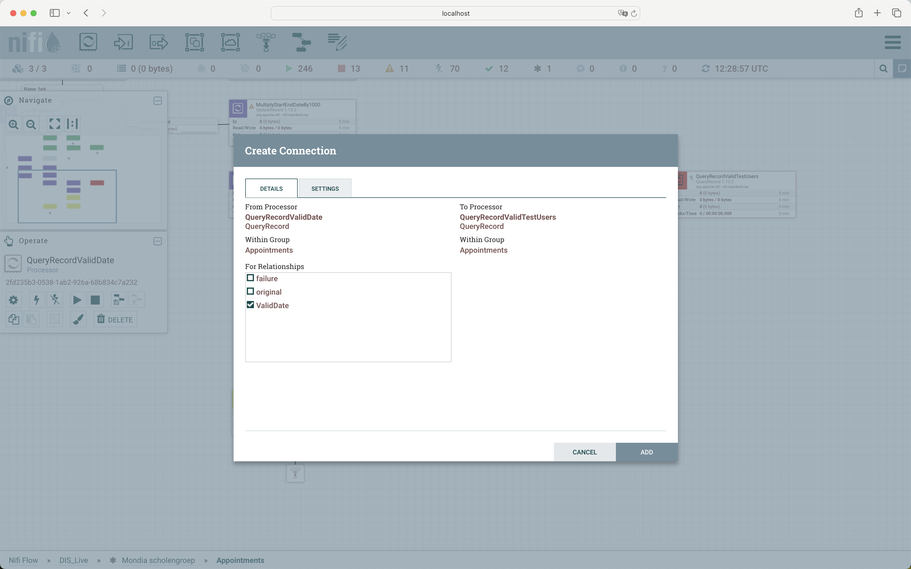
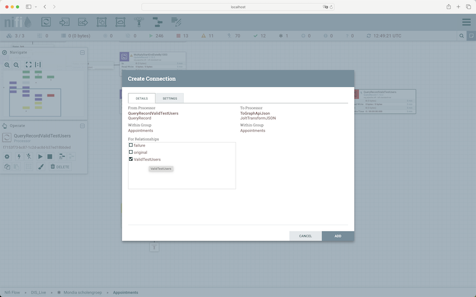

## SOP test users rooster synchronisation Zermelo

### Open an Existing Processing Group

* Initially, establish a connection to AKS and Apache NiFi by following the "CONNECT-TO-AKS" SOP.
* Access Apache NiFi's interface by navigating to http://localhost:8080/nifi in your web browser. 
 
   
 
* Locate and select the "DIS_Live" Process Group. From there, choose a specific Process Group, such as "Mondia scholengroep," and open it.
* Open the process group Appointments.

### Configure test users

* Locate the "QueryRecordValidTestUsers", and access its configuration.
* Adjust the property ValidTestUsers accordingly. For example:   
SELECT * FROM FLOWFILE WHERE email IN ('a.dejonge@mondia.nl','c.but@mondia.nl','y.kerke@mondia.nl','g.dewit@mondia.nl','d.schonen@mondia.nl',
'l.honkoops@mondia.nl','d.hansen@mondia.nl','c.dekom@mondia.nl','g.vanderatelburg@mondia.nl','l.vanderuiten@mondia.nl')

### Create connections

* Create a connection from processor QueryRecordValidDate to processor QueryRecordValidTestUsers processor for the relationship ValidDate.

 

* Create a connection from processor QueryRecordValidTestUsers to processor ToGraphApiJson for the relationship  ValidTestUsers

 
 
 * Completion of these steps successfully configures the test users.